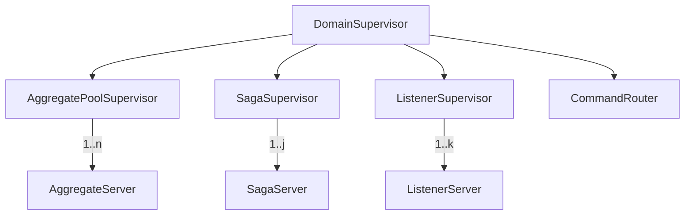

# Tragedy

Tragedy is a framework for event-sourced applications, inspired heavily by
[Commanded](https://github.com/commanded/commanded).

Define your domain using the protocols and behaviors provided by
[Calamity](https://github.com/Cantido/calamity), then you can start
dispatching events to Tragedy where they will update aggregates and
publish events.

> [!WARNING]
> This project is called Tragedy because that's what will happen if you try
> to use this in production. It is currently very experimental.

## Usage

Tragedy organizes processes into three categories: Aggregates, Sagas,
and Listeners.

- *Aggregates* form the core of your business logic, receiving commands from
  your application, and producing events that describe what actions take place.
- *Sagas* receive events and can issue commands of their own, so that you can
  coordinate aggregates and implement complex logic with steps that can fail.
- *Listeners* also receive events and allow you to plug in arbitrary business
  logic, like read model projections.

First, define an aggregate with `Calamity`:

```elixir
defmodule MyApp.BankAccount do
  use Calamity, :aggregate

  defstruct [
    :account_id,
    :balance
  ]

  def new(id) do
    %__MODULE__{account_id: id}
  end

  defimpl Calamity.Aggregate do
    def id(account) do
      account.account_id
    end

    def execute(%{account_id: account_id}, %MyApp.CreateAccount{account_id: account_id}) do
      %MyApp.AccountCreated{account_id: account_id}
    end

    def apply(account, %MyApp.AccountCreated{}) do
      %{account | balance: 0}
    end
  end
end
```

Then, you must define a command that will affect that aggregate, as well as
one or more events that indicate what the command caused to happen:

```elixir
defmodule MyApp.CreateAccount do
  @derive {Calamity.Command, mod: MyApp.BankAccount, key: :account_id}
  defstruct [
    :account_id
  ]
end

defmodule MyApp.AccountCreated do
  defstruct [
    :account_id
  ]
end
```

Once you have these data structures, you can hand them to Tragedy to be run.

```elixir
pid =
  start_supervised!(
    {DomainSupervisor, %DomainConfig{}}
  )

:ok = DomainSupervisor.dispatch(pid, %MyApp.CreateAccount{account_id: "1"})
```

When this `CreateAccount` command is handed to the domain supervisor, Tragedy will:

1. create a new `GenServer` process for the `BankAccount` aggregate with `account_id: "1"`
2. execute the command in the new aggregate, which produces an `AccountCreated` event
3. update the aggregate using the event

Since we don't have any sagas or listeners, that's the end of this story.
See the HexDocs for information on how to create those.

## Architecture

Aggregates, sagas, and listeners all run in separate processes, and handle
events concurrently, each category under its own supervisor.



## Installation

If [available in Hex](https://hex.pm/docs/publish), the package can be installed
by adding `tragedy` to your list of dependencies in `mix.exs`:

```elixir
def deps do
  [
    {:tragedy, "~> 0.1.0"}
  ]
end
```

Documentation can be generated with [ExDoc](https://github.com/elixir-lang/ex_doc)
and published on [HexDocs](https://hexdocs.pm). Once published, the docs can
be found at <https://hexdocs.pm/tragedy>.

## License

Copyright (C) 2024 Rosa Richter

This program is free software: you can redistribute it and/or modify
it under the terms of the GNU Affero General Public License as
published by the Free Software Foundation, either version 3 of the
License, or (at your option) any later version.

This program is distributed in the hope that it will be useful,
but WITHOUT ANY WARRANTY; without even the implied warranty of
MERCHANTABILITY or FITNESS FOR A PARTICULAR PURPOSE.  See the
GNU Affero General Public License for more details.

You should have received a copy of the GNU Affero General Public License
along with this program.  If not, see <https://www.gnu.org/licenses/>.
